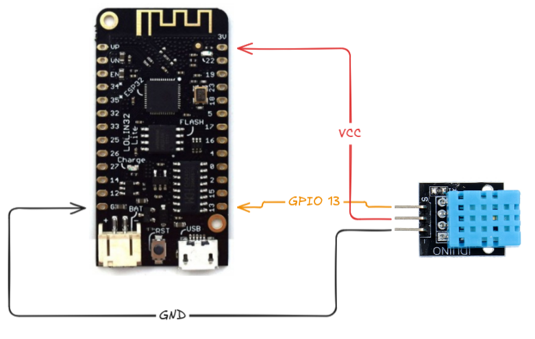

# ESP-NOW Slave — Sensor & Weather Client

This firmware implements an ESP-NOW slave that reports local sensor data, requests weather information via a master proxy, and sends structured weather state back to the master.

Overview
--------

- Device scans ESP-NOW channels and locks to a master beacon.
- Registers with the master and sends binary states: `Identity`, `Sensor`, `Weather`, `SlaveAlive`.
- Requests weather data from Open-Meteo through the master proxy and receives chunked binary responses which are reassembled by a pipeline.

Key files
---------

- Entrypoint: `src/main.cpp`
- ESP-NOW slave logic: `src/app/espnow/slave.cpp`
- Weather pipeline: `src/app/espnow/weather_pipeline.cpp`
- Open-Meteo locations/URLs: `src/app/weather/open_meteo_locations.cpp`

Wire protocol
-------------

See `src/app/espnow/state_binary.h` for the binary wire formats.

Outbound (`PacketType::STATE`): `IdentityState`, `SensorState`, `WeatherState`, `SlaveAliveState`, `ProxyReqState`.

Inbound (`PacketType::COMMAND`): `ProxyRespChunkCommand`, `WeatherSyncReqCommand`.

Configuration
-------------

Edit `include/app_config.h` for device identity and feature toggles:

- `DEVICE_NAME`
- DHT settings: `DHT_SENSOR_ENABLED`, `DHT_SENSOR_PIN`, `DHT_SENSOR_IS_DHT22`, `DHT_READ_INTERVAL_MS`
- Weather settings: `WEATHER_REPORT_ENABLED`, `WEATHER_AREA_INDEX`, `WEATHER_REPORT_INTERVAL_MS`, `WEATHER_PROXY_REQUEST_INTERVAL_MS`

Build & flash
-------------

Example (PlatformIO):

```bash
platformio run -e wemos-lolin32-lite
platformio run -e wemos-lolin32-lite -t upload --upload-port /dev/ttyUSB0
platformio device monitor -e wemos-lolin32-lite --port /dev/ttyUSB0
```

Notes
-----

- The slave only accepts commands from a validated master beacon.
- If the master times out, the slave returns to channel-scan mode.
- Proxy responses are received as ordered chunks and reassembled by the `weather_pipeline` task.

Schema
------

- Weather message schema diagram: 

Related repositories
--------------------

- ESP-NOW Master (gateway): https://github.com/jahrulnr/espnow-pio-master.git
- ESP-NOW Weather (this repo): https://github.com/jahrulnr/espnow-pio-weather.git
- ESP-NOW Cam (camera slave): https://github.com/jahrulnr/espnow-pio-camera.git
